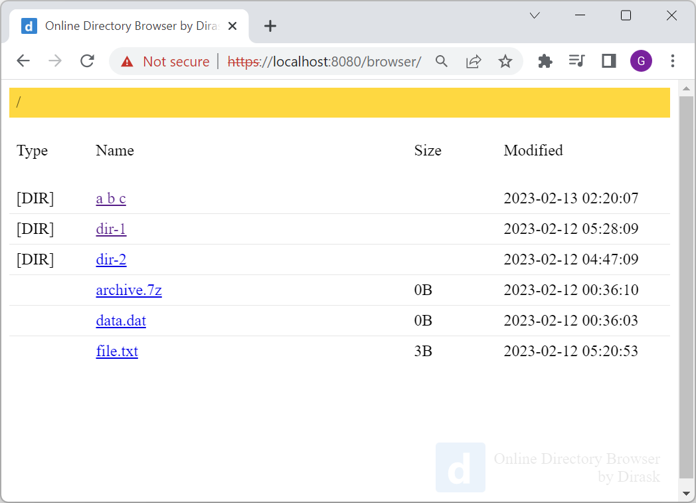

# Online Directory Browser by Dirask (Express.js + React)

This project was created to let user share directories and files using simple web page interface.



Project contains logic that lets to run application in production and development mode.

## Installation

### Dependencies

Before, we will start using applications we should install dependencies. 

In the `backend/` and `frontend/` directories, run:

```
npm ci install
```

### Certificates

When we want to run application using HTTPS server we should configure certificate and his private key.

Paste certificate and his private key to the `backend/` directory or generate new one using:

```
openssl.exe req -x509 -newkey rsa:4096 -keyout key.pem -out cert.pem -days 365 -nodes -subj '/CN=localhost'
```

> Hint: check [this article](https://dirask.com/posts/openssl-generate-localhost-pem-certificate-under-Windows-1enOWD) to know ways how to generate own certificate.

### Configuration

In the `backend/.env` file you sould find example condifguration ready to use.

## Production (use it to run application on your server)

Provided backend logic lets to display frontend application as attached resources without additional process.

### Building

In the `frontend/` directory, run:

```
npm run build
```

### Running

In the `backend/` directory, run:

```
npm run start:production
```

In the web browser just open backend application using:

```
https://localhost:8080
```
> Hint: use valid certificate or confirm own one in the web browser during first visit.

> Note: you can change configuration in `backend/.env` file.

## Development (use it only if you are programmer)

Provided backend logic lets to display frontend application and reload its source code on changes (automatic reloading). It means frontend application uses all developer features and is available directly from backend API.

In the `frontend/` directory, run:

```
npm run start
```

In the `backend/` directory, run:

```
npm run start:development
```

In the web browser just open backend application using:

```
https://localhost:8080
```
> Hint: use valid certificate or confirm own one in the web browser during first visit.

> Note: you can change configuration in `backend/.env` file.
